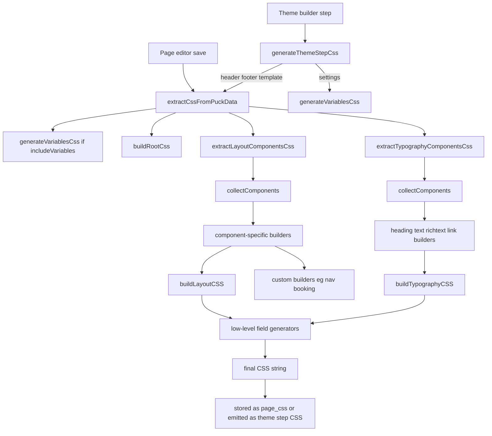

# Puck CSS Generation Flow

Status: working reference
Audience: human + AI agent
Last verified: 2026-05-14

## Why this exists

Puck CSS in ByteForge is generated through multiple paths:

- editor-time inline CSS for live preview
- storefront/page-save CSS aggregation stored in `pages.page_css`
- theme-step CSS generation for header/footer/template/settings

Most rendering parity bugs come from drift between those paths rather than from a single low-level CSS helper.

## High-Level Flow

## Runtime Entry Points

### 1. Page editor save path

- Tenant editor save calls `extractCssFromPuckData(...)` before sending `page_css` to the API in [resources/js/apps/tenant/components/pages/PageEditorPage.tsx](resources/js/apps/tenant/components/pages/PageEditorPage.tsx#L180).
- Central editor save uses the same pattern in [resources/js/apps/central/components/pages/PageEditorPage.tsx](resources/js/apps/central/components/pages/PageEditorPage.tsx).
- `_rootId` is injected before generation so root selectors become page-scoped.

### 2. Theme builder path

- Theme step CSS is routed through `generateThemeStepCss(...)` in [resources/js/shared/puck/services/ThemeStepCssGenerator.ts](resources/js/shared/puck/services/ThemeStepCssGenerator.ts#L12).
- `settings` emits only CSS variables.
- `header`, `footer`, and `template` reuse `extractCssFromPuckData(..., false)` to avoid duplicating variables in section files.

### 3. Editor preview path

- Individual Puck components call `buildLayoutCSS(...)` or `buildTypographyCSS(...)` directly during edit mode.
- Page root preview uses [resources/js/shared/puck/config/RootRenderer.tsx](resources/js/shared/puck/config/RootRenderer.tsx#L18).

## Core Aggregator Structure

The main aggregation pipeline lives in [resources/js/shared/puck/services/PuckCssAggregator.ts](resources/js/shared/puck/services/PuckCssAggregator.ts).

### `extractCssFromPuckData(...)`

This is the storefront/page-save orchestrator.

It combines:

1. `generateVariablesCss(themeData)` when `includeVariables === true`
2. `buildRootCss(puckData, resolver)`
3. `extractLayoutComponentsCss(puckData, themeData)`
4. `extractTypographyComponentsCss(puckData, themeData)`

### `extractLayoutComponentsCss(...)`

This path:

1. traverses the tree with `collectComponents(...)`
2. picks layout-like components (`box`, `card`, `button`, `image`, `navigationmenu`, form controls, booking widget)
3. maps each component to a component-specific adapter such as `buildBoxCss(...)` or `buildButtonCss(...)`
4. usually delegates to `buildLayoutCSS(...)`

### `extractTypographyComponentsCss(...)`

This path:

1. traverses the same tree
2. filters typography-like components (`heading`, `text`, `richtext`, `link`)
3. maps each component to a typography adapter
4. delegates to `buildTypographyCSS(...)` plus any component-specific extras like rich text defaults or hover rules

## Shared Builder Layer

The shared CSS builder functions live in [resources/js/shared/puck/fields/cssBuilder.ts](resources/js/shared/puck/fields/cssBuilder.ts).

### `buildLayoutCSS(...)`

This function is the common layout/styling assembler. It delegates to low-level field generators for:

- display
- flex/grid behavior
- position and offsets
- transform
- z-index
- opacity
- overflow
- visibility
- width/height/min/max
- padding/margin
- border/border radius
- shadow
- background
- image object-fit/object-position

### `buildTypographyCSS(...)`

This function handles the common typography/styling layer for heading-like components:

- layout basics shared with text blocks
- text alignment
- color/background
- font family and weight
- line height and letter spacing
- text transform and decoration
- cursor and transition

## Parity Hotspots

These are the places most likely to drift.

### 1. Aggregator adapters vs editor component renderers

The editor preview often calls `buildLayoutCSS(...)` or `buildTypographyCSS(...)` directly inside the component render tree, while storefront CSS goes through adapter functions in `PuckCssAggregator.ts`.

That means parity bugs usually come from missing adapter logic, not from the shared builders themselves.

Typical examples:

- class name mismatch between component DOM and aggregator output
- component-specific props handled in editor but omitted in aggregator
- defaults resolved differently in the adapter vs the component render function

### 2. Root scoping depends on `_rootId`

`buildRootCss(...)` only emits page-scoped root selectors when `_rootId` is present.

If save flows forget to inject `_rootId`, merged page CSS loses page scoping and becomes conflict-prone.

### 3. Variable inclusion is context-sensitive

- page save and theme section generation usually call `extractCssFromPuckData(..., false)`
- full CSS generation may include `generateVariablesCss(...)`

When checking a bug, always verify whether missing behavior is due to omitted theme variables versus missing component rules.

### 4. Custom component builders bypass some shared assumptions

Some builders are intentionally special-cased:

- navigation menu uses `buildNavigationMenuCss(...)`
- booking widget uses `buildBookingWidgetCssVars(...)` plus static CSS
- rich text appends default typography rules outside `buildTypographyCSS(...)`

These areas deserve extra parity tests because they are not pure wrappers around the shared builder layer.

## Fast Debug Checklist

When a block looks correct in the editor but wrong on the storefront, check in this order:

1. Does the DOM class name generated by the component match the selector generated by the aggregator adapter?
2. Does the component render path apply props that the adapter forgot to map?
3. Does the issue live in the shared builder layer or only in the component-specific adapter?
4. Is `_rootId` present for page-scoped selectors?
5. Is the failing CSS dependent on theme variables that were intentionally excluded?

## Existing Test Anchors

- Aggregator coverage: [resources/js/shared/puck/services/__tests__/PuckCssAggregator.test.ts](resources/js/shared/puck/services/__tests__/PuckCssAggregator.test.ts#L252)
- Theme-step generator coverage: [resources/js/shared/puck/services/__tests__/ThemeStepCssGenerator.test.ts](resources/js/shared/puck/services/__tests__/ThemeStepCssGenerator.test.ts)
- Shared builder coverage: [resources/js/shared/puck/fields/__tests__/Phase4CSSBuilder.test.ts](resources/js/shared/puck/fields/__tests__/Phase4CSSBuilder.test.ts)

## Recommended Next Slice

Use this map to fix one parity or control issue at a time:

1. reproduce the block/control issue
2. identify whether the mismatch is in a component adapter, shared builder, or root scoping
3. add or tighten the smallest existing test near that layer
4. patch the specific adapter/control
5. rerun the narrowest relevant test
